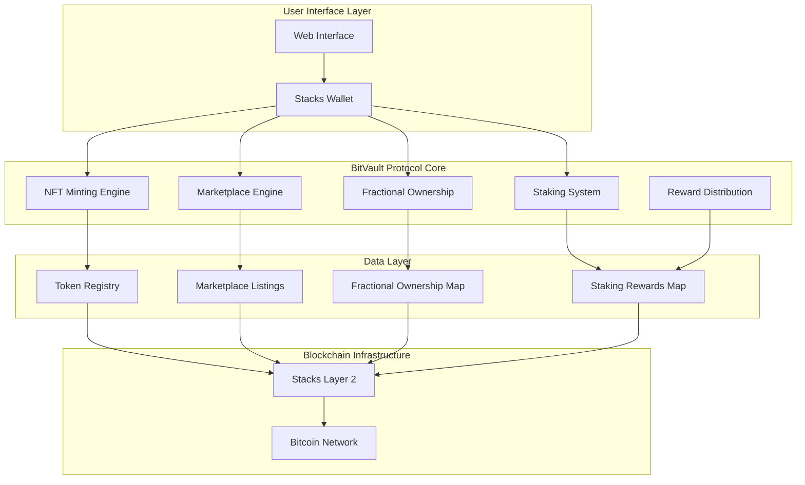
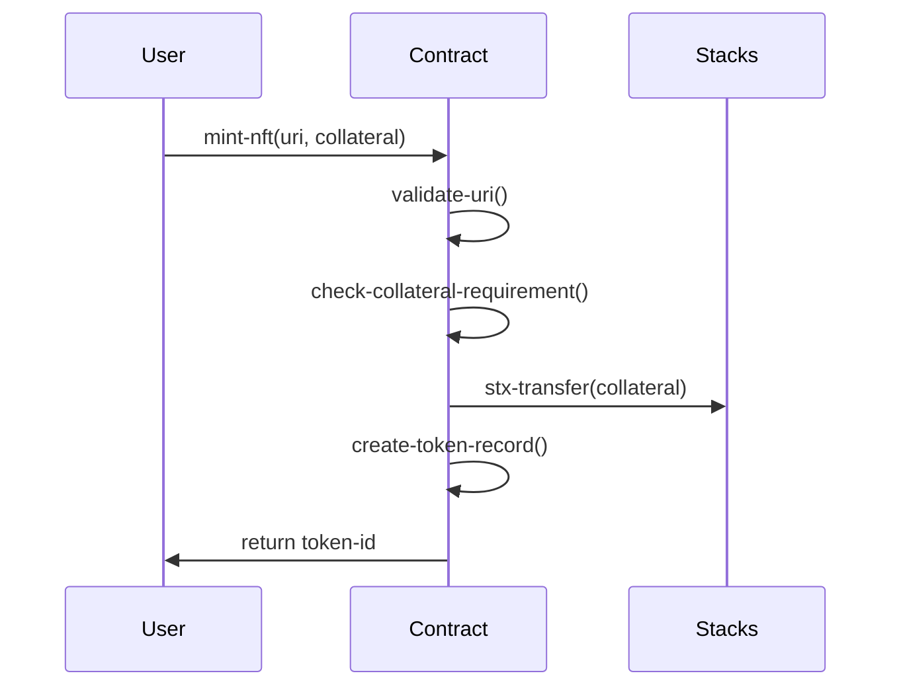
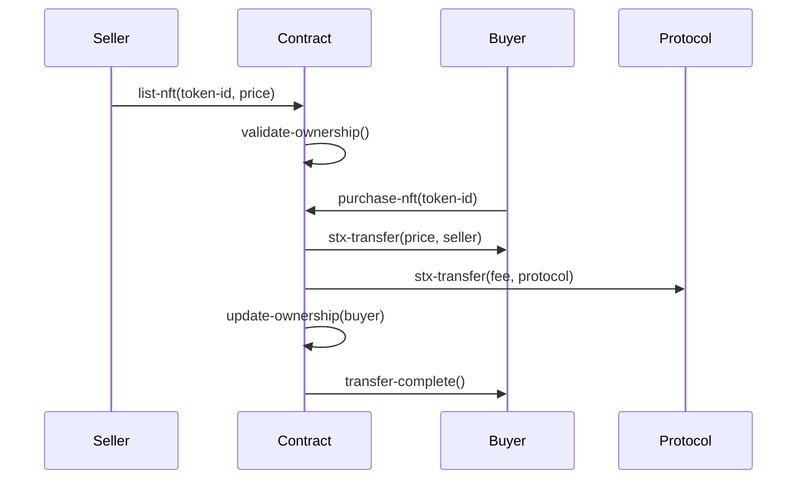
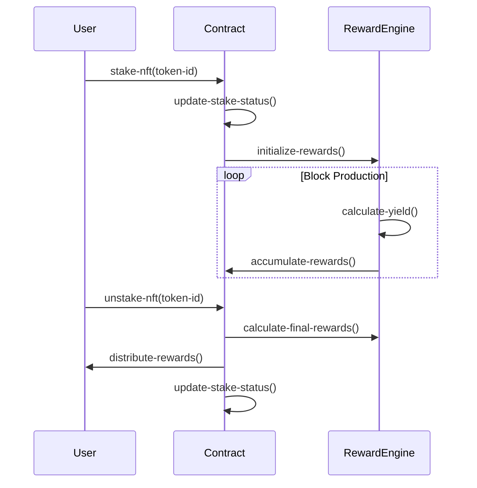

# BitVault Protocol

> **Bitcoin-Native NFT Finance Platform** - Transforming digital assets into productive financial instruments on Stacks Layer 2

[](https://stacks.co)
[](https://bitcoin.org)

## 🌟 Overview

BitVault Protocol revolutionizes the NFT landscape by creating a comprehensive DeFi ecosystem that leverages Bitcoin's security through Stacks Layer 2. Our protocol transforms static NFTs into dynamic financial instruments through collateralized minting, marketplace trading, fractional ownership, and yield-generating staking mechanisms.

### Key Features

- **🔒 Collateralized NFT Minting** - Mint NFTs backed by STX collateral with customizable ratios
- **🏪 Integrated Marketplace** - Trade NFTs with built-in fee distribution and liquidity
- **🧩 Fractional Ownership** - Democratize access through share-based ownership systems
- **📈 Staking & Yields** - Generate passive income through block-based reward calculations
- **⚡ Bitcoin Security** - Inherit Bitcoin's trustless guarantees via Stacks integration
- **🛡️ Risk Management** - Advanced overflow protection and collateral monitoring

## 🏗️ System Architecture



## 🔧 Contract Architecture

### Core Components

#### 1. **NFT Engine**

- **Token Registry**: Maintains comprehensive NFT metadata and ownership
- **Collateral Management**: Enforces minimum collateral ratios and security
- **Transfer System**: Secure ownership transfers with validation

#### 2. **Marketplace Engine**

- **Listing Management**: Active marketplace with price discovery
- **Trade Execution**: Automated settlement with fee distribution
- **Protocol Fees**: Sustainable revenue model for platform growth

#### 3. **Fractional Ownership System**

- **Share Tokenization**: Convert NFT ownership into tradeable shares
- **Transfer Mechanics**: Secure share transfers between participants
- **Governance Rights**: Proportional voting based on ownership stakes

#### 4. **Staking & Rewards**

- **Yield Generation**: Block-based reward calculations
- **Compound Growth**: Automatic reward accumulation
- **Flexible Unstaking**: Withdraw assets with final reward distribution

### Data Structures

```clarity
;; Core NFT Registry
tokens: {
    token-id -> {
        owner: principal,
        uri: string,
        collateral: uint,
        is-staked: bool,
        stake-timestamp: uint,
        fractional-shares: uint
    }
}

;; Marketplace Listings
token-listings: {
    token-id -> {
        price: uint,
        seller: principal,
        active: bool
    }
}

;; Fractional Ownership
fractional-ownership: {
    (token-id, owner) -> {
        shares: uint
    }
}

;; Staking Rewards
staking-rewards: {
    token-id -> {
        accumulated-yield: uint,
        last-claim: uint
    }
}
```

## 🔄 Data Flow Architecture

### 1. NFT Minting Flow



### 2. Marketplace Trading Flow



### 3. Staking & Rewards Flow



## 🚀 Getting Started

### Prerequisites

- [Stacks CLI](https://docs.stacks.co/docs/write-smart-contracts/overview)
- [Clarinet](https://github.com/hirosystems/clarinet)
- Stacks Wallet (Hiro Wallet recommended)

### Installation

```bash
# Clone the repository
git clone https://github.com/manuel-ebuka/bitvault.git
cd bitvault

# Install Clarinet
npm install -g @stacks/clarinet-cli

# Initialize project
clarinet new bitvault
cd bitvault

# Copy contract files
cp ../contracts/* contracts/
```

### Deployment

```bash
# Test locally
clarinet test

# Deploy to testnet
clarinet deploy --testnet

# Deploy to mainnet
clarinet deploy --mainnet
```

## 📊 Protocol Economics

### Collateral Requirements

- **Minimum Ratio**: 150% (configurable)
- **Liquidation Protection**: Automated monitoring
- **Risk Mitigation**: Overcollateralization ensures protocol stability

### Fee Structure

- **Protocol Fee**: 2.5% on marketplace transactions
- **Staking Yield**: 5% annual rate (block-based calculation)
- **Gas Optimization**: Efficient contract design minimizes transaction costs

### Tokenomics

- **Collateral Token**: STX (Stacks native token)
- **Yield Distribution**: Proportional to stake duration
- **Fee Revenue**: Reinvested for protocol development and rewards

## 🔐 Security Features

### Access Controls

- **Owner Validation**: Strict ownership verification
- **Transfer Restrictions**: Prevent unauthorized transfers
- **Staking Locks**: Secure asset locking during staking periods

### Risk Management

- **Overflow Protection**: SafeMath implementations
- **Collateral Monitoring**: Real-time ratio tracking
- **Emergency Controls**: Circuit breakers for critical situations

### Audit & Compliance

- **Code Review**: Comprehensive security audits
- **Bitcoin Anchoring**: Inherit Bitcoin's proven security model
- **Regulatory Compliance**: Built for institutional adoption

## 🛠️ API Reference

### Core Functions

#### Minting

```clarity
(mint-nft (uri (string-ascii 256)) (collateral uint))
;; Returns: (response uint uint)
```

#### Trading

```clarity
(list-nft (token-id uint) (price uint))
(purchase-nft (token-id uint))
;; Returns: (response bool uint)
```

#### Staking

```clarity
(stake-nft (token-id uint))
(unstake-nft (token-id uint))
;; Returns: (response bool uint)
```

#### Fractional Ownership

```clarity
(transfer-shares (token-id uint) (recipient principal) (share-amount uint))
;; Returns: (response bool uint)
```

### Read-Only Functions

```clarity
(get-token-info (token-id uint))
(get-listing (token-id uint))
(get-fractional-shares (token-id uint) (owner principal))
(get-staking-rewards (token-id uint))
(calculate-rewards (token-id uint))
(get-protocol-stats)
```

## 🌐 Ecosystem Integration

### Stacks Ecosystem

- **DeFi Protocols**: Interoperable with major Stacks DeFi platforms
- **Wallet Support**: Compatible with all major Stacks wallets
- **Developer Tools**: Built using standard Stacks development stack

### Bitcoin Integration

- **Security Model**: Leverages Bitcoin's proof-of-work consensus
- **Settlement Layer**: Final settlement anchored to Bitcoin blockchain
- **Cross-Chain**: Future compatibility with Bitcoin Layer 2 solutions

## 🤝 Contributing

We welcome contributions from the community! Please see our [Contributing Guidelines](CONTRIBUTING.md) for details on:

- Code standards and conventions
- Pull request process
- Bug reporting procedures
- Feature request guidelines

## ⚡ Roadmap

### Phase 1: Core Protocol

- ✅ Smart contract development
- ✅ Security audits
- 🔄 Testnet deployment
- 🔄 Community testing

### Phase 2: Platform Launch

- 📋 Mainnet deployment
- 📋 Web interface launch
- 📋 Marketplace integration
- 📋 Mobile wallet support

### Phase 3: Advanced Features

- 📋 Cross-chain bridges
- 📋 Governance token launch
- 📋 Advanced derivatives
- 📋 Institutional tools

### Phase 4: Ecosystem Expansion

- 📋 Layer 3 scaling solutions
- 📋 Enterprise partnerships
- 📋 Global compliance framework
- 📋 Advanced AI-powered features

---

**Built with ❤️ for the Bitcoin ecosystem** | **Powered by Stacks** | **Secured by Bitcoin**
